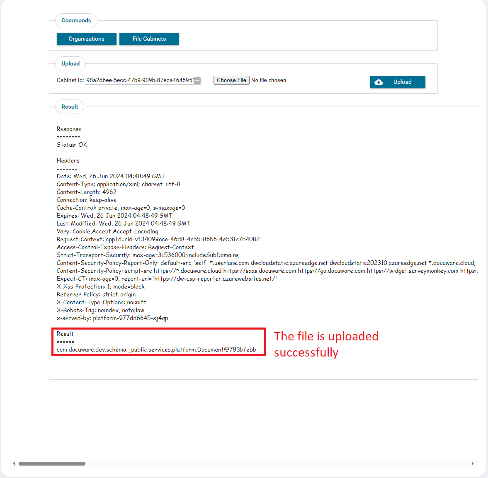
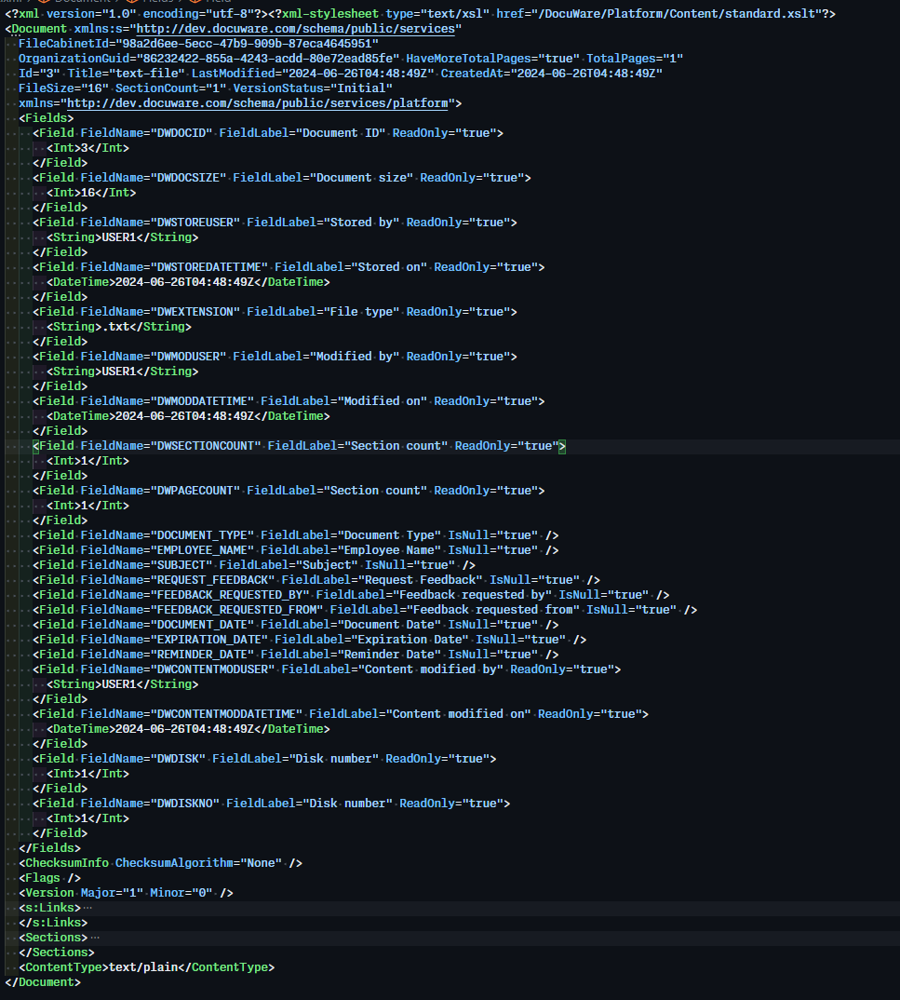
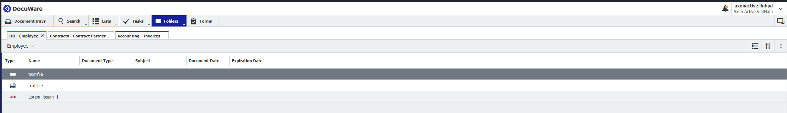
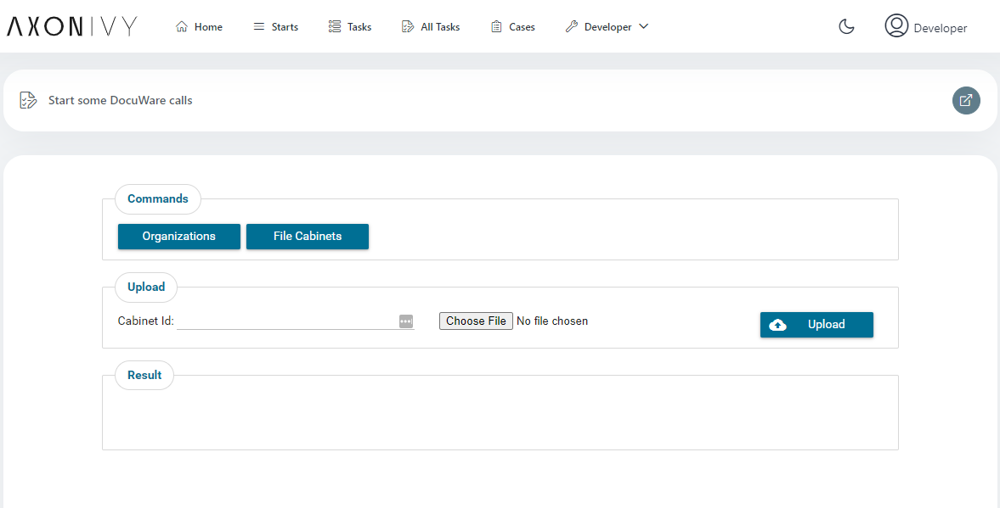
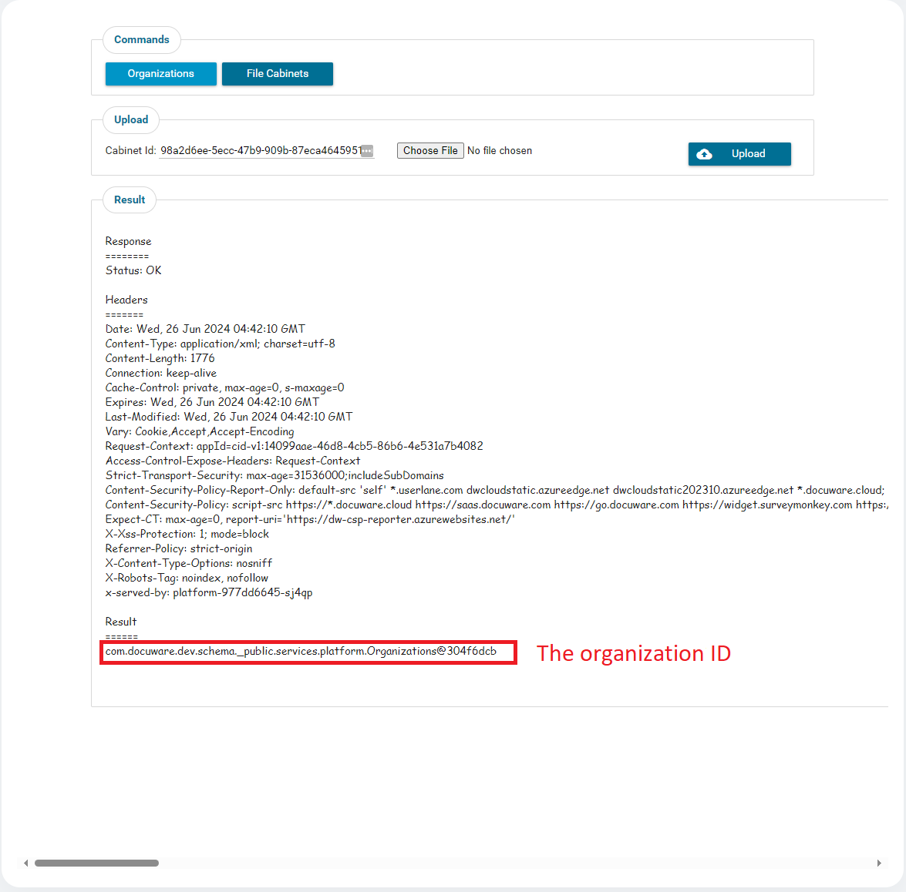
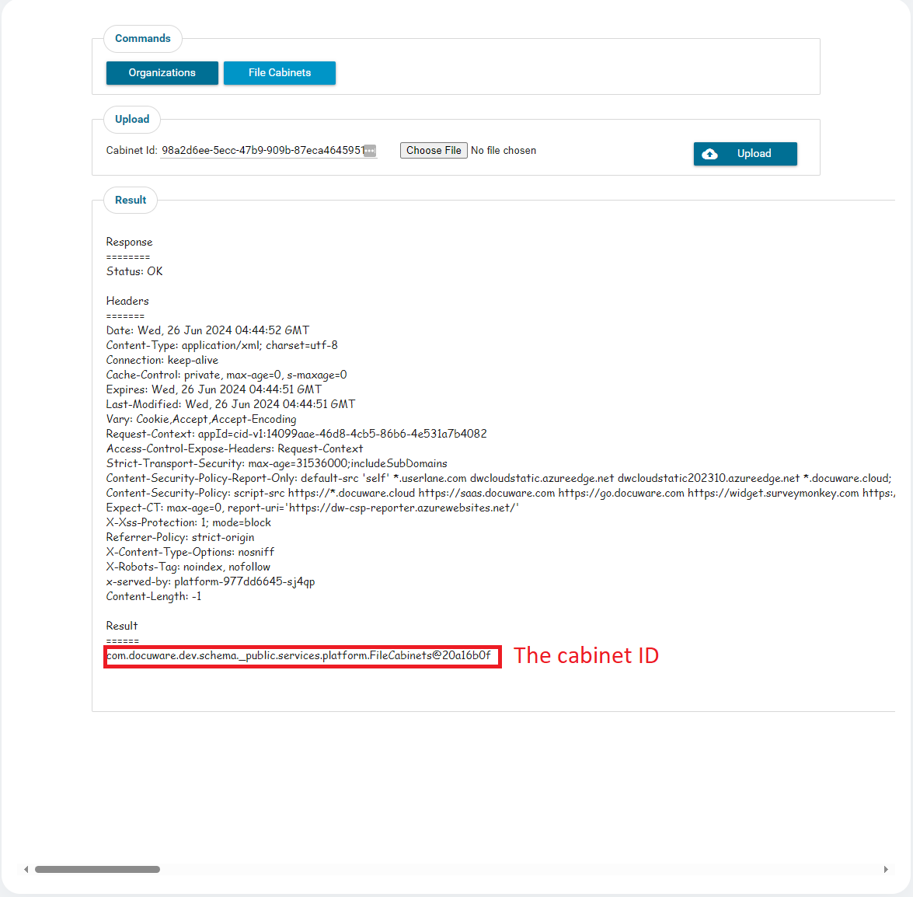

# DocuWare Connector

[DocuWare](https://start.docuware.com/) offers cloud-based document management and workflow automation software. It can be used to digitize, archive and process any business documents in an audit-proof manner to optimize your company's core processes.

The Axon Ivy DocuWare connector enables efficient integration of DocuWare functionalities into your Axon Ivy process applications

This connector:

- minimizes your integration effort: use the demo version, which contains examples of the API calls.
- is based on REST web service technologies.
- gives you access to basic DocuWare functions.

## Demo

1. Upload a document to a DocuWare file cabinet.

Upload result





The uploaded file in Docuware dashboard.



2. Provide a GUI to test some basic DocuWare calls.



Get Organizations: click on Organizations button to get the organization id and automatically add to the request when upload file.



Get File Cabinets: click on File Cabinets button to get the cabinet ID of the organization to locate which cabinet that the file will be uploaded.



## Setup

Before any interactions between the Axon Ivy Engine and DocuWare services can be run, they have to be introducted to each other. This can be done as follows:

1. Get a DocuWare account and the DocuWare cloud `host`, `user-name`, and `password` to use.

2. Override the global variables for `host`, `username`, and `password` in the demo project as shown in the example below.

```
@variables.yaml@
```

3. DocuWare supports 3 ways to generate an Access Token from the Identity Service:

    3.a Request Token by Username & Password - GrantType is `password`
    
    3.b Request Token by a DocuWare Token - GrantType is `dwtoken`
    
    3.c Request Token by Username & Password (Trusted User) - GrantType is `trusted`

4. For GrantType is `dwtoken`, we must get a LoginToken. Please start the process startRequestALoginToken.ivp and follow the guide to generate a new LoginToken

If your REST URL does not follow the predefined REST URL pattern of this connector, you can change the URL in the Engine Cockpit. To change the URL in the Designer, you have to unpack the connector project and change it there.

Run `start.ivp` of the DocuWareDemo demo process to test your setup.

