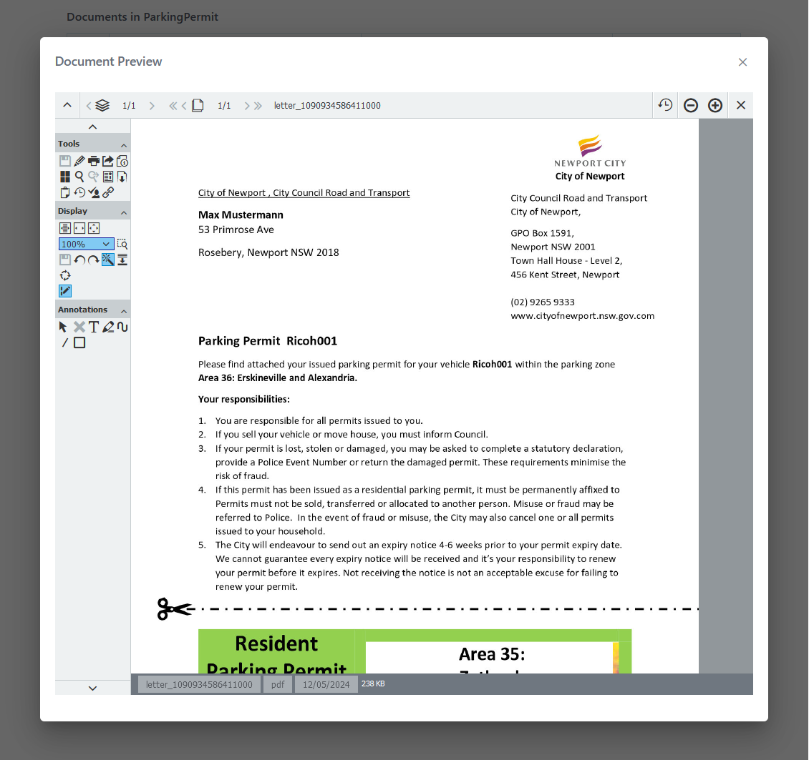
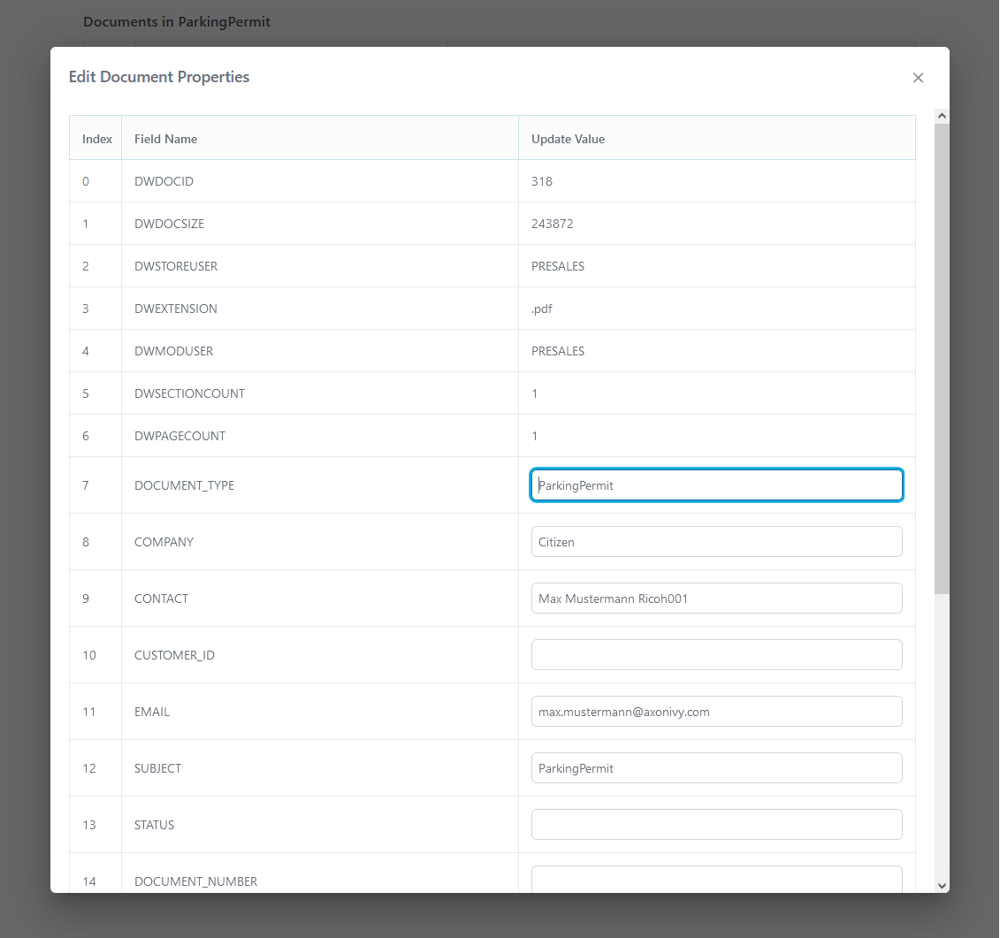
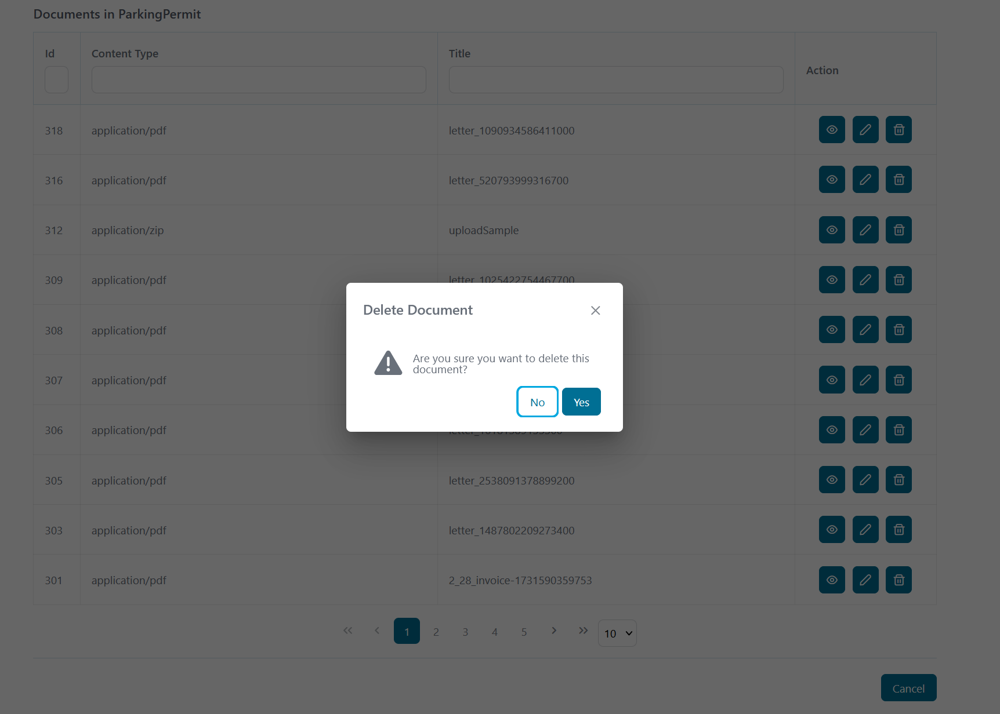

# DocuWare Connector

[DocuWare](https://start.docuware.com/) offers cloud-based document management and workflow automation software. It can be used to digitize, archive and process any business documents in an audit-proof manner to optimize your company's core processes.

The Axon Ivy DocuWare connector enables efficient integration of DocuWare functionalities into your Axon Ivy process applications

This connector:

- minimizes your integration effort: use the demo to see examples of API calls.
- is based on REST web service technologies.
- gives you access to the DocuWare REST API.

## Demo

The demo offers a GUI to guide you through some basic DocuWare features, a GUI to retrieve a list of documents from your default organization and the first file cabinet found and some workflows with examples of other calls.

### Basic Docuware Features

Start **Basic DocuWare Calls** and either configure a fixed organization and file cabinet in global variables or **Fetch Organizations** and **Fetch FileCabinets** to use the first objects found instead.
Once you select a file cabinet id, additional functions to **Fetch Documents** will be available. The first document found will be used as the demo document. Nevertheless, you
can enter ids manually for all input fields to use different objects. Once a document id is set, the document can be downloaded or attached to the current case. If you upload
a document, it's documentId will be set automatically and you can directly work with it.

### Document Viewing

Start **View/Edit Document** to get basic viewer showing how to add, change, view and delete documents. Note, that viewing of documents might require additional setup of your DocuWare installation to allow embedding
of DocuWare frames into your AxonIvy frames.

   

**Document Properties Editing**  
Modify document properties, including metadata and custom fields.

   

**Document Deletion**  
Delete documents from the file cabinet.

   

### Other demos

Other process starts show examples of DocuWare usage.

## Setup

Before any interactions between the Axon Ivy Engine and DocuWare services can be run, they have to be introducted to each other.
All configurations are done in global variables. Whether cloud or on-premise, you must define the `host` which is the hostname of
your DocuWare installation.

The connector supports different grant-types. Depending on the grant-type, other credentials are used.

### Grant type `password`

This is the typical type used for cloud solutions. Ivy will use a technical user to connect to DocuWare and all
calls will be done using this user. The history of a document will show this technical user independent of the
real Ivy user. For this grant-type you need to set `username` and `password` of the DocuWare user.

### Grant type `trusted`

This can be used in on-premise solutions. It will use a trusted user to connect, but it will impersonate the current
Ivy user name for calls. Therefore, the history of a document will show the real Ivy user. For this grant-type
you need to set `trustedUserName`, `trustedUserPassword` and `username` (to be used for special users).

Notes:

* For this to work, the Ivy user must have the same name as the DocuWare user
* For System user and unauthenticated users, the configured `username` will be used.

### Grant type `dw_token`

This can be used, if you got the user token by some other means. Note, that this use-case is probably not yet fully
supported and should be seen as a demo. You can start the process **Request a LoginToken for DW-Token** to play
around with this grant-type.

### Other configuration variables

Other configuration variables are documented directly in the variables supported by the connector. Please see there
for a description and copy it to your project, if you are using it, so that it will be visible in the Engine cockpit
for your application.

```
@variables.yaml@
```

If the connector misses features that you need, you can unpack it to your project and extend it there. In this case
consider to propose/offer your change to the Axon Ivy market.

