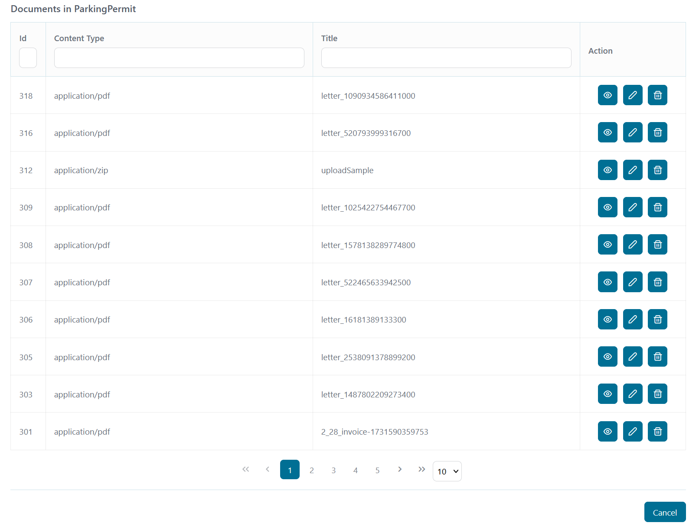

# DocuWare Connector

[DocuWare](https://start.docuware.com/) bietet cloudbasierte Dokumentenverwaltung und Workflow-Automatisierungssoftware. Es kann verwendet werden, um alle Geschäftsdokumente revisionssicher zu digitalisieren, zu archivieren und zu verarbeiten, um die Kernprozesse Ihres Unternehmens zu optimieren.

Der Axon Ivy DocuWare-Connector ermöglicht eine effiziente Integration von DocuWare-Funktionalitäten in deine Axon Ivy Prozessanwendungen.

Dieser Connector:

- minimiert den Integrationsaufwand: Verwende die Demo-Version, die Beispiele für API-Aufrufe enthält.
- basiert auf REST-Webdienst-Technologien.
- gibt dir Zugriff auf grundlegende DocuWare-Funktionen.

## Demo

### Funktionen

1. **Abruf von Organisationen**  
   Klicke auf die Schaltfläche **Organisationen**, um die Organisations-ID abzurufen. Das System fügt diese ID automatisch in nachfolgende Anfragen ein.

    

2. **Abruf von Dateiablagen**  
    Klicke auf die Schaltfläche **Dateiablagen**, um die Ablagen-ID der ausgewählten Organisation abzurufen. Die Ablagen-ID bestimmt, wohin die Datei hochgeladen wird.

    

3. **Hochladen von Dokumenten**  
    Wähle eine Datei aus, die in die ausgewählte DocuWare-Dateiablage hochgeladen werden soll. Du kannst die hochgeladene Datei auf dem DocuWare-Dashboard überprüfen.

    

4. **Abruf von Dokumenten**  
   Dokumente werden automatisch abgerufen, indem die vordefinierten Felder **organization** und **fileCabinetId** aus der Datei `variables.yaml` verwendet werden.

   

5. **Anzeigen von Dokumenten**  
   Dokumente können direkt in der Benutzeroberfläche mithilfe des DocuWare-Dokumentenbetrachters angezeigt werden.

   

6. **Bearbeiten von Dokumenteigenschaften**  
   Ändere die Dokumenteigenschaften, einschließlich Metadaten und benutzerdefinierter Felder.

   

7. **Löschen von Dokumenten**  
   Lösche die Dokumente aus der Dateiablage.

   

Um Dokumente anzuzeigen und deren Eigenschaften zu bearbeiten, starte den Prozess mit dem Namen **DocuWare View/Edit Document**.

Um Dokumente hochzuladen und Aktionen wie Abruf von Organisationen, Abruf von Dateiablagen und Hochladen von Dokumenten auszuführen, starte den Prozess mit dem Namen **Start some DocuWare calls**.

## Setup

Bevor eine Interaktion zwischen der Axon Ivy Engine und den DocuWare-Diensten ausgeführt werden kann, müssen diese mit einander verknüpft werden. Dies kann wie folgt durchgeführt werden:

1. Erstelle ein DocuWare-Konto und nutze den DocuWare-Cloud-`host`, `user-name` und das `password`.

2. Überschreibe die globalen Variablen für `host`, `username` und `password` im Demo-Projekt wie im folgenden Beispiel gezeigt:

   ```yaml
   @variables.yaml@
   
3. DocuWare unterstützt 3 Methoden, um ein Zugriffstoken vom Identitätsdienst zu generieren:

    3.a Zugriffstoken per Benutzername und Passwort anfordern - GrantType ist `password`
    
    3.b Zugriffstoken mit einem DocuWare-Token anfordern - GrantType ist `dwtoken`
    
    3.c Zugriffstoken per Benutzername und Passwort (Trusted User) anfordern - GrantType ist `trusted`

4. Für GrantType `dwtoken` muss ein LoginToken generiert werden. Starte den Prozess `startRequestALoginToken.ivp` und folge der Anleitung, um ein neues LoginToken zu erstellen.

Wenn deine REST-URL nicht dem vordefinierten REST-URL-Muster dieses Connectors entspricht, kannst du die URL im Engine Cockpit ändern. Um die URL im Designer zu ändern, musst du das Connector-Projekt entpacken und dort ändern.

Starte `start.ivp` des DocuWareDemo-Demoprozesses, um deine Einrichtung zu testen.
